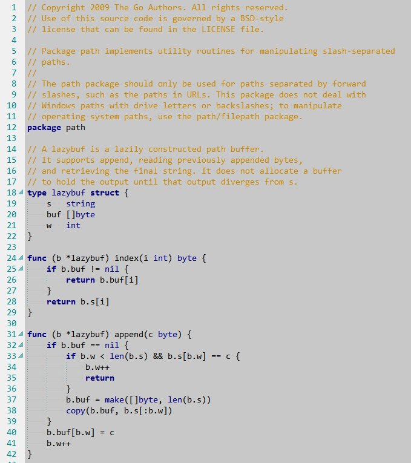

# 说明

本文修改于2023-02-08，使用LiteIDE X33.3，操作系统为Windows。

# 使用

[LiteIDE](http://liteide.org/cn/)下载后解压即可使用。配色方案的所有配置文件都位于`liteide/share/liteide/liteeditor/color`中，也即将喜欢的配色方案保存XML文件于此即可。

选择配色方案，需于LiteIDE点击“查看(V)”-“选项”打开对话框。再在左侧选择“LiteEditor”，右侧选择“字体与颜色”标签，“编辑器颜色方案”下拉选择对应的XML文件即可。

# 特点

对码农来说，自定义配色方案，首要目的是护眼，尽量中明度，低反差。我个人不太喜欢主流的黑底白字（或绿/黄/蓝字等等），那种感觉就像关了灯被窝里看手机，亮瞎了！普通的白底黑字亮度又太高，因此做了个折中，字还是黑色，但把底色换成灰。这就是该配色方案叫做gv-gray的原因。

上个效果图：



# 配置文件

配置文件内容如下。以UTF-8编码保存至配置`gv-gray.xml`中即可使用（详情参看[使用]()小节）。

```xml
<?xml version="1.0" encoding="UTF-8"?>
<style-scheme version="1.0" name="gv-gray">
  <!-- GV gray color scheme -->
  <style name="Text" foreground="#000000" background="#C8C8C8"/>
  <style name="Extra" foreground="#008B8B" background=""/>
  <style name="Selection" background="#3399FF"/>
  <style name="CurrentLine" background="#BBBBBB"/>
  <style name="IndentLine" foreground="#008B8B"/>
  <style name="VisualWhitespace" foreground="#c0c0c0"/>
  <style name="Keyword" foreground="#000080" bold="true"/>
  <style name="DataType" foreground="#000080" />
  <style name="Decimal" foreground="#800080"/>
  <style name="BaseN" foreground="#800080"/>
  <style name="Float" foreground="#800080"/>
  <style name="Char" foreground="#800000"/>
  <style name="String" foreground="#008000"/>
  <style name="Comment" foreground="#cc8800"/>
  <style name="Alert" foreground="#ff0000"/>
  <style name="Error" foreground="#ff0000"/>
  <style name="Function" foreground="#000000"/>
  <style name="RegionMarker" foreground="#000000"/>
  <style name="Symbol" foreground="#000000"/>
  <style name="BuiltinFunc" foreground="#000080"/>
  <style name="Predeclared" foreground="#000080"/>
  <style name="FuncDecl" foreground="#000000"/>
  <style name="Placeholder" foreground="#008080"/>
  <style name="ToDo" foreground="#006000" background="#e0e0e0" bold="true"/>
</style-scheme>
```
