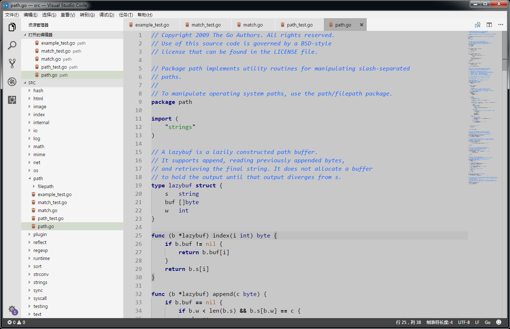
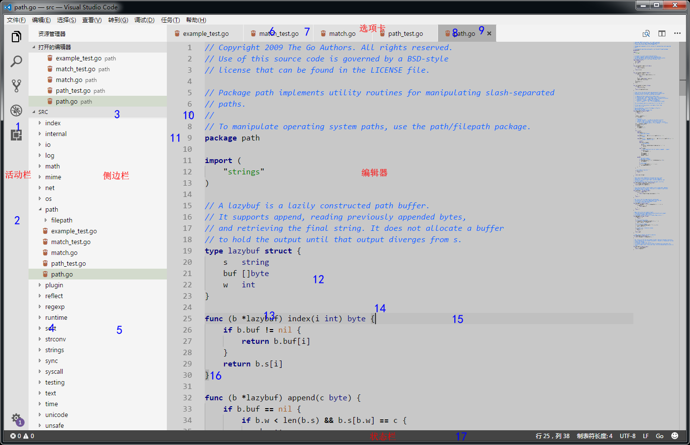

# 说明

本文更新于2023-12-26，使用VSCode 1.85.1，操作系统为Windows。

# 配置文件

“文件-首选项-颜色主题”即可显示所有可用的颜色主题，上下选择后Enter即可。也可通过Ctrl+Shift+P输入`Preferences: Color Theme`回车后调出“首选项：颜色主题”面板。

记VSCode的安装目录为`$RELEASE`，默认的颜色主题配置文件都位于`$RELEASE/resources/app/extensions`目录中。以`theme-`开头的目录即为颜色主题配置（事实上，其中有些是文件图标主题）。除若干主题会共用一个目录外（`theme-defaults`），大多数主题都是一个主题一个目录。

每个颜色主题配置目录包含：
	* themes目录：目录下通常使用.json文件设置具体的配色方案。
	* OSSREADME.json：描述版权等相关信息，可以忽略。
	* package.json：令VSCode读取后能区分不同的配色方案。

下面新增一个灰色调颜色主题。在`$RELEASE/resources/app/extensions`目录下新增如下目录结构。如果不关心配置文件相关参数的解释，可无需细读后面内容，只需将相应的配置文本复制至配置文件中（UTF-8编码）。重启VSCode即可选择此颜色主题。

```
$RELEASE/resources/app/extensions/
 \_ theme-gv-gray/
     \_ themes/
     |   \_ gv-gray-color-theme.json
     |_ package.json
```

# 预览图



# package.json

package.json文件内容如下：

```json
{
	"name": "theme-gv-gray",
	"version": "0.1.0",
	"publisher": "GV",
	"engines": { "vscode": "*" },
	"contributes": {
		"themes": [
			{
				"label": "gv-gray",
				"uiTheme": "vs",
				"path": "./themes/gv-gray-color-theme.json"
			}
		]
	}
}
```

| 参数名                           | 作用                                                                       |
| -------------------------------- | -------------------------------------------------------------------------- |
| name                             | 主题ID，必需在VSCode中全局唯一，即所有主题的package.json中该值均不能重复   |
| contributes -> themes -> label   | 主题名，“文件-首选项-颜色主题”的列表中显示该值                             |
| contributes -> themes -> uiTheme | VSCode整体的UI主题，vs为浅色主题                                           |
| contributes -> themes -> path    | 定义配色方案的文件名，如为相对路径则相对于此文件                           |

# gv-gray-color-theme.json

因配置文件内容太长放至文末，以下说明对照配置文件内容阅读更易理解。

VSCode使用其以下两个节点：

| 参数名       | 作用                                     |
| ------------ | ---------------------------------------- |
| colors       | VSCode各个UI组件的颜色                   |
| tokenColors  | 语法高亮颜色                             |

## colors

colors节点的内容直接通过键值对参数描述，以下列举几个参数的作用：

| 图示 | 参数名                              | 作用                                                   |
| ---: | ----------------------------------- | ------------------------------------------------------ |
|    2 | activityBar.background              | 活动栏背景色                                           |
|    1 | activityBar.foreground              | 活动栏前景色(例如用于图标)                             |
|   12 | editor.background                   | 编辑器背景颜色                                         |
|   13 | editor.foreground                   | 编辑器默认前景色                                       |
|      | editor.findMatchBackground          | 当前搜索匹配项的颜色                                   |
|      | editor.findMatchHighlightBackground | 其他搜索匹配项的颜色                                   |
|   15 | editor.lineHighlightBackground      | 光标所在行高亮文本的背景颜色                           |
|      | editor.selectionBackground          | 编辑器所选内容的颜色                                   |
|      | editor.selectionHighlightBackground | 与所选内容具有相同内容的区域颜色                       |
|      | editor.rangeHighlightBackground     | 突出显示范围的背景颜色，例如 "Quick Open" 和“查找”功能 |
|   16 | editorBracketMatch.background       | 匹配括号的背景色                                       |
|   14 | editorCursor.foreground             | 编辑器光标颜色                                         |
|   11 | editorGutter.background             | 编辑器导航线的背景色，导航线包括边缘符号和行号         |
|   10 | editorLineNumber.foreground         | 编辑器行号颜色                                         |
|    5 | sideBar.background                  | 侧边栏背景色                                           |
|    4 | sideBar.foreground                  | 侧边栏前景色                                           |
|    3 | sideBarSectionHeader.background     | 侧边栏节标题的背景颜色                                 |
|   17 | statusBar.background                | 标准状态栏背景色                                       |
|   17 | statusBar.noFolderBackground        | 没有打开文件夹时状态栏的背景色                         |
|   17 | statusBar.debuggingBackground       | 调试程序时状态栏的背景色                               |
|    9 | tab.activeBackground                | 活动选项卡的背景色                                     |
|    8 | tab.activeForeground                | 活动组中活动选项卡的前景色                             |
|    7 | tab.inactiveBackground              | 非活动选项卡的背景色                                   |
|    6 | tab.inactiveForeground              | 活动组中非活动选项卡的前景色                           |



## tokenColors

tokenColors使用一个对象数组描述各语法高亮颜色。每个对象有如下结构：

```json
{
	"name": "Comment",
	"scope": [
		"comment",
		"punctuation.definition.comment"
	],
	"settings": {
		"background": "#ffffff",
		"fontStyle": "italic",
		"foreground": "#000000"
	}
}
```

| 参数名                    | 作用                                     |
| ------------------------- | ---------------------------------------- |
| name                      | 规则描述，一段容易理解的描述性文字       |
| scope                     | 作用域，指定使用那些VSCode内部对象，其含义参看[Scope Naming](https://www.sublimetext.com/docs/3/scope_naming.html) |
| setting -> background     | 背景色，可选                             |
| setting -> fontStyle      | 字体，可选，为bold、italic、underline    |
| setting -> foreground     | 前景色，可选                             |

以下列举文末的配置文件中几个name所指定的参数的作用：

| 参数名                     | 作用           |
| -------------------------- | -------------- |
| Character                  | 字符           |
| Class                      | 类名           |
| Comment                    | 注释           |
| Function                   | 函数名         |
| Keyword                    | 关键字         |
| Number                     | 数值           |
| Operator                   | 运算符         |
| Parameter                  | 函数参数       |
| Punctuation                | 标点符号       |
| String                     | 字符串         |
| Type                       | 内置类型       |
| Variable                   | 变量名         |

## 文件内容

```json
{
	"name": "gv-gray",
	"colors": {
		"activityBar.background": "#e0e0e0",
		"activityBar.foreground": "#000000",
		"editor.background": "#c8c8c8",
		"editor.foreground": "#000000",
		"editor.findMatchBackground": "#ffff00",
		"editor.findMatchHighlightBackground": "#ffff00",
		"editor.lineHighlightBackground": "#c0c0c0",
		"editor.selectionBackground": "#b0b0b0",
		"editor.selectionHighlightBackground": "#dfdfdf",
		"editor.rangeHighlightBackground": "#b0b0b0",
		"editorBracketMatch.background": "#b0b0b0",
		"editorCursor.foreground": "#333333",
		"editorGutter.background": "#d3d3d3",
		"editorLineNumber.foreground": "#777777",
		"sideBar.background": "#f5f5f5",
		"sideBar.foreground": "#000000",
		"sideBarSectionHeader.background": "#e0e0e0",
		"statusBar.background": "#444444",
		"statusBar.noFolderBackground": "#444444",
		"statusBar.debuggingBackground": "#444444",
		"tab.activeBackground": "#afafaf",
		"tab.activeForeground": "#000000",
		"tab.inactiveBackground": "#e0e0e0",
		"tab.inactiveForeground": "#000000",
		// Other colors.
		"activityBarBadge.background": "#705697",
		"button.background": "#705697",
		"dropdown.background": "#F5F5F5",
		"editorGroup.dropBackground": "#C9D0D988",
		"editorWhitespace.foreground": "#AAAAAA",
		"focusBorder": "#A6B39B",
		"inputOption.activeBorder": "#adafb7",
		"inputValidation.infoBorder": "#4ec1e5",
		"inputValidation.infoBackground": "#f2fcff",
		"inputValidation.warningBackground": "#fffee2",
		"inputValidation.warningBorder": "#ffe055",
		"inputValidation.errorBackground": "#ffeaea",
		"inputValidation.errorBorder": "#f1897f",
		"list.activeSelectionForeground": "#6c6c6c",
		"list.focusBackground": "#CADEB9",
		"list.activeSelectionBackground": "#c4d9b1",
		"list.inactiveSelectionBackground": "#d3dbcd",
		"list.highlightForeground": "#9769dc",
		"notification.background": "#442e66",
		"panel.background": "#F5F5F5",
		"peekViewEditor.matchHighlightBackground": "#C2DFE3",
		"peekViewTitle.background": "#F2F8FC",
		"peekViewEditor.background": "#F2F8FC",
		"peekViewResult.background": "#F2F8FC",
		"peekView.border": "#705697",
		"peekViewResult.matchHighlightBackground": "#93C6D6",
		"pickerGroup.foreground": "#A6B39B",
		"pickerGroup.border": "#749351"
	},
	"tokenColors": [
		{
			"settings": {
				"background": "#ffffff",
				"foreground": "#000000"
			}
		},
		{
			"name": "Character",
			"scope": [
				"constant",
				"constant.character"
			],
			"settings": {
				"foreground": "#008000"
			}
		},
		{
			"name": "Class",
			"scope": [
				"entity.name.type",
				"entity.other.inherited-class",
				"support.class"
			],
			"settings": {
				"foreground": "#000080"
			}
		},
		{
			"name": "Comment",
			"scope": [
				"comment",
				"punctuation.definition.comment"
			],
			"settings": {
				"fontStyle": "italic",
				"foreground": "#0066ff"
			}
		},
		{
			"name": "Function",
			"scope": [
				"entity.name.function",
				"support.function"
			],
			"settings": {
				"foreground": "#000000"
			}
		},
		{
			"name": "Keyword",
			"scope": [
				"keyword",
				"storage"
			],
			"settings": {
				"fontStyle": "bold",
				"foreground": "#000080"
			}
		},
		{
			"name": "Number",
			"scope": [
				"constant.numeric"
			],
			"settings": {
				"foreground": "#0044bb"
			}
		},
		{
			"name": "Operator",
			"scope": "keyword.operator",
			"settings": {
				"foreground": "#000000"
			}
		},
		{
			"name": "Parameter",
			"scope": "variable.parameter",
			"settings": {
				"fontStyle": "underline"
			}
		},
		{
			"name": "Punctuation",
			"scope": "punctuation",
			"settings": {
				"foreground": "#000000"
			}
		},
		{
			"name": "String",
			"scope": "string",
			"settings": {
				"foreground": "#008000"
			}
		},
		{
			"name": "Type",
			"scope": [
				"storage.type",
				"support.type"
			],
			"settings": {
				"fontStyle": "",
				"foreground": "#000080"
			}
		},
		{
			"name": "Variable",
			"scope": [
				"support.variable",
				"variable"
			],
			"settings": {
				"foreground": "#000000"
			}
		},
		// Other token colors.
		{
			"name": "Comments: Preprocessor",
			"scope": "comment.block.preprocessor",
			"settings": {
				"fontStyle": "",
				"foreground": "#AAAAAA"
			}
		},
		{
			"name": "Comments: Documentation",
			"scope": [
				"comment.documentation",
				"comment.block.documentation"
			],
			"settings": {
				"foreground": "#448C27"
			}
		},
		{
			"name": "Invalid - Deprecated",
			"scope": "invalid.deprecated",
			"settings": {
				"background": "#96000014"
			}
		},
		{
			"name": "Invalid - Illegal",
			"scope": "invalid.illegal",
			"settings": {
				"background": "#96000014",
				"foreground": "#660000"
			}
		},
		{
			"name": "Language Constants",
			"scope": [
				"constant.language",
				"support.constant",
				"variable.language"
			],
			"settings": {
				"foreground": "#AB6526"
			}
		},
		{
			"name": "Exceptions",
			"scope": "entity.name.exception",
			"settings": {
				"foreground": "#660000"
			}
		},
		{
			"name": "Sections",
			"scope": "entity.name.section",
			"settings": {
				"fontStyle": "bold"
			}
		},
		{
			"name": "Strings: Escape Sequences",
			"scope": "constant.character.escape",
			"settings": {
				"foreground": "#777777"
			}
		},
		{
			"name": "Strings: Regular Expressions",
			"scope": "string.regexp",
			"settings": {
				"foreground": "#4B83CD"
			}
		},
		{
			"name": "Strings: Symbols",
			"scope": "constant.other.symbol",
			"settings": {
				"foreground": "#AB6526"
			}
		},
		{
			"name": "Embedded Source",
			"scope": [
				"string source",
				"text source"
			],
			"settings": {
				"background": "#EAEBE6"
			}
		},
		{
			"name": "HTML: Doctype Declaration",
			"scope": [
				"meta.tag.sgml.doctype",
				"meta.tag.sgml.doctype string",
				"meta.tag.sgml.doctype entity.name.tag",
				"meta.tag.sgml punctuation.definition.tag.html"
			],
			"settings": {
				"foreground": "#AAAAAA"
			}
		},
		{
			"name": "HTML: Tags",
			"scope": [
				"meta.tag",
				"punctuation.definition.tag.html",
				"punctuation.definition.tag.begin.html",
				"punctuation.definition.tag.end.html"
			],
			"settings": {
				"foreground": "#91B3E0"
			}
		},
		{
			"name": "HTML: Tag Names",
			"scope": "entity.name.tag",
			"settings": {
				"foreground": "#4B83CD"
			}
		},
		{
			"name": "HTML: Attribute Names",
			"scope": [
				"meta.tag entity.other.attribute-name",
				"entity.other.attribute-name.html"
			],
			"settings": {
				"fontStyle": "italic",
				"foreground": "#91B3E0"
			}
		},
		{
			"name": "HTML: Entities",
			"scope": [
				"constant.character.entity",
				"punctuation.definition.entity"
			],
			"settings": {
				"foreground": "#AB6526"
			}
		},
		{
			"name": "CSS: Selectors",
			"scope": [
				"meta.selector",
				"meta.selector entity",
				"meta.selector entity punctuation",
				"entity.name.tag.css"
			],
			"settings": {
				"foreground": "#7A3E9D"
			}
		},
		{
			"name": "CSS: Property Names",
			"scope": [
				"meta.property-name",
				"support.type.property-name"
			],
			"settings": {
				"foreground": "#AB6526"
			}
		},
		{
			"name": "CSS: Property Values",
			"scope": [
				"meta.property-value",
				"meta.property-value constant.other",
				"support.constant.property-value"
			],
			"settings": {
				"foreground": "#448C27"
			}
		},
		{
			"name": "CSS: Important Keyword",
			"scope": "keyword.other.important",
			"settings": {
				"fontStyle": "bold"
			}
		},
		{
			"name": "Markup: Changed",
			"scope": "markup.changed",
			"settings": {
				"background": "#FFFFDD",
				"foreground": "#000000"
			}
		},
		{
			"name": "Markup: Deletion",
			"scope": "markup.deleted",
			"settings": {
				"background": "#FFDDDD",
				"foreground": "#000000"
			}
		},
		{
			"name": "Markup: Emphasis",
			"scope": "markup.italic",
			"settings": {
				"fontStyle": "italic"
			}
		},
		{
			"name": "Markup: Error",
			"scope": "markup.error",
			"settings": {
				"background": "#96000014",
				"foreground": "#660000"
			}
		},
		{
			"name": "Markup: Insertion",
			"scope": "markup.inserted",
			"settings": {
				"background": "#DDFFDD",
				"foreground": "#000000"
			}
		},
		{
			"name": "Markup: Link",
			"scope": "meta.link",
			"settings": {
				"foreground": "#4B83CD"
			}
		},
		{
			"name": "Markup: Output",
			"scope": [
				"markup.output",
				"markup.raw"
			],
			"settings": {
				"foreground": "#777777"
			}
		},
		{
			"name": "Markup: Prompt",
			"scope": "markup.prompt",
			"settings": {
				"foreground": "#777777"
			}
		},
		{
			"name": "Markup: Heading",
			"scope": "markup.heading",
			"settings": {
				"foreground": "#AA3731"
			}
		},
		{
			"name": "Markup: Strong",
			"scope": "markup.bold",
			"settings": {
				"fontStyle": "bold"
			}
		},
		{
			"name": "Markup: Traceback",
			"scope": "markup.traceback",
			"settings": {
				"foreground": "#660000"
			}
		},
		{
			"name": "Markup: Underline",
			"scope": "markup.underline",
			"settings": {
				"fontStyle": "underline"
			}
		},
		{
			"name": "Markup Quote",
			"scope": "markup.quote",
			"settings": {
				"foreground": "#7A3E9D"
			}
		},
		{
			"name": "Markup Lists",
			"scope": "markup.list",
			"settings": {
				"foreground": "#4B83CD"
			}
		},
		{
			"name": "Markup Styling",
			"scope": [
				"markup.bold",
				"markup.italic"
			],
			"settings": {
				"foreground": "#448C27"
			}
		},
		{
			"name": "Markup Inline",
			"scope": "markup.inline.raw",
			"settings": {
				"fontStyle": "",
				"foreground": "#AB6526"
			}
		},
		{
			"name": "Extra: Diff Range",
			"scope": [
				"meta.diff.range",
				"meta.diff.index",
				"meta.separator"
			],
			"settings": {
				"background": "#DDDDFF",
				"foreground": "#434343"
			}
		},
		{
			"name": "Extra: Diff From",
			"scope": "meta.diff.header.from-file",
			"settings": {
				"background": "#FFDDDD",
				"foreground": "#434343"
			}
		},
		{
			"name": "Extra: Diff To",
			"scope": "meta.diff.header.to-file",
			"settings": {
				"background": "#DDFFDD",
				"foreground": "#434343"
			}
		}
	]
}
```
